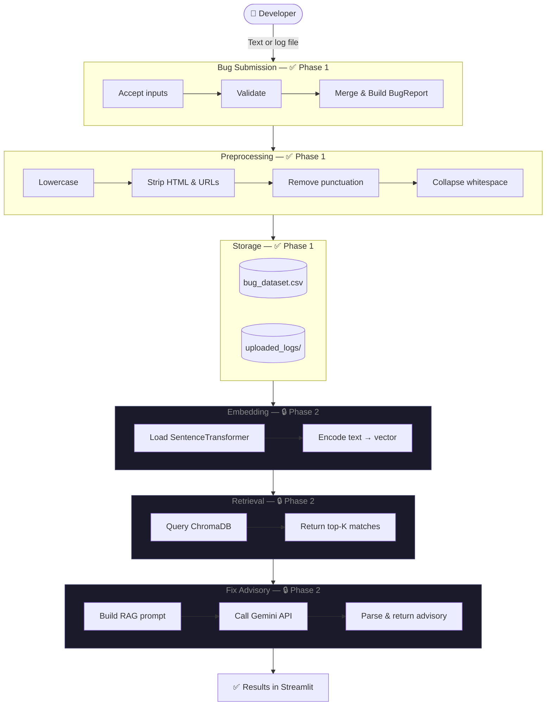

# Pipeline Diagrams

All diagrams use [Mermaid](https://mermaid.js.org/) syntax.
Render them in any Mermaid-compatible viewer (GitHub, VS Code extension, mermaid.live).

## Full pipeline (both phases)

