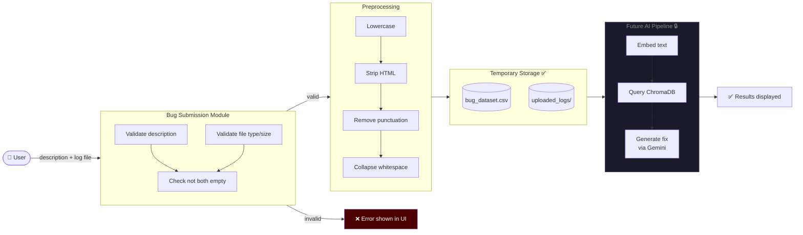
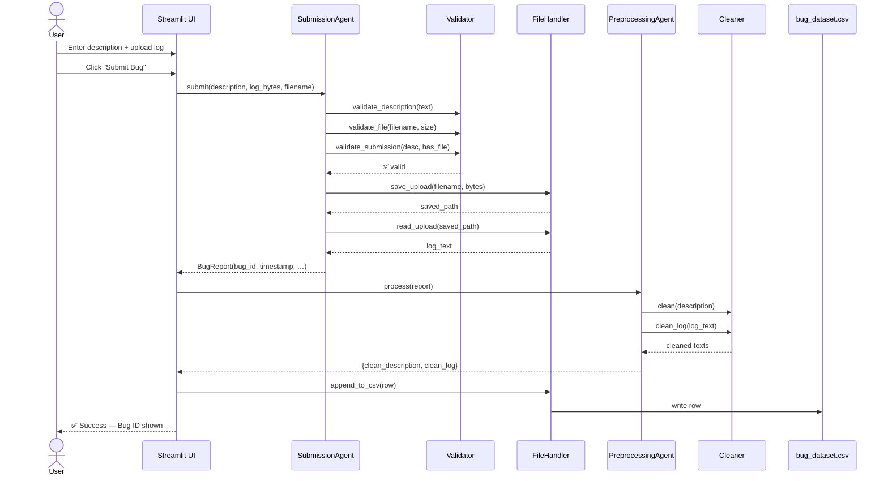
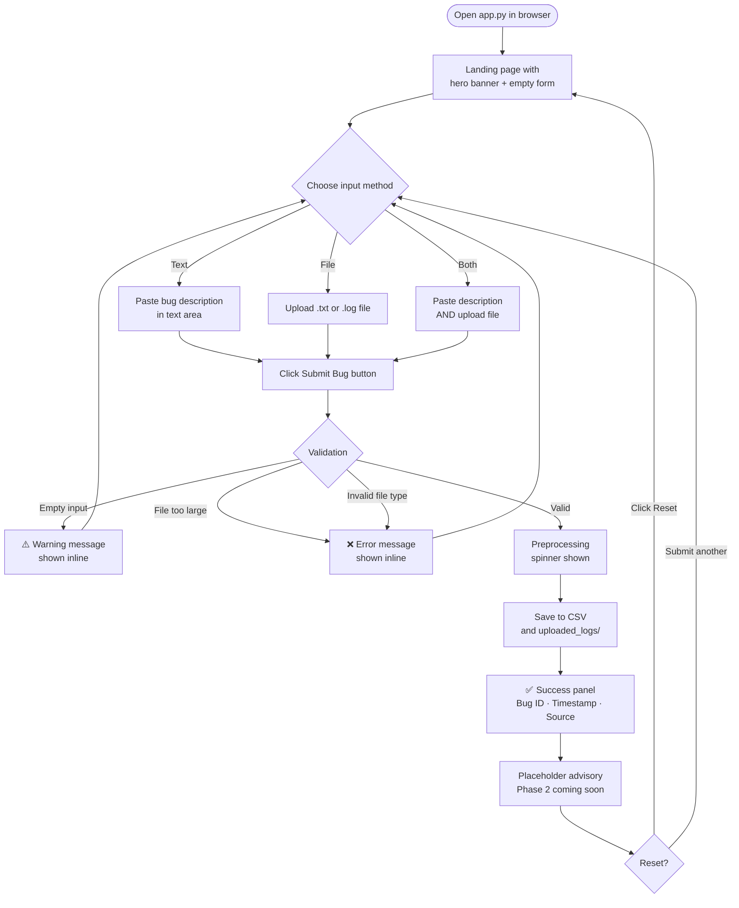

# System Architecture & Data Flow

## 1. Overall System Architecture

```mermaid
graph TB
    subgraph UI ["🖥️ Streamlit UI (app.py)"]
        S[Sidebar\nKB stats · Settings]
        I[Input Panel\nText area · File uploader]
        R[Results Panel\nBug info · Advisory]
    end

    subgraph Agents ["🤖 Agent Layer"]
        A1[SubmissionAgent\n✅ Phase 1]
        A2[PreprocessingAgent\n✅ Phase 1]
        A3[EmbeddingAgent\n🔒 Phase 2]
        A4[RetrievalAgent\n🔒 Phase 2]
        A5[FixAdvisorAgent\n🔒 Phase 2]
    end

    subgraph Utils ["🔧 Utilities"]
        V[Validator]
        C[Cleaner]
        F[FileHandler]
        L[Logger]
    end

    subgraph Storage ["💾 Storage"]
        CSV[(bug_dataset.csv)]
        UPL[(uploaded_logs/)]
        VDB[(ChromaDB\n🔒 Phase 2)]
    end

    subgraph External ["☁️ External — Phase 2"]
        G[Google Gemini API]
        ST[SentenceTransformers]
    end

    I --> A1
    A1 --> V
    A1 --> F
    A1 --> A2
    A2 --> C
    A2 --> A3
    A3 --> ST
    A3 --> A4
    A4 --> VDB
    A4 --> A5
    A5 --> G
    A5 --> R
    F --> CSV
    F --> UPL

    style A3 fill:#1a1a2a,stroke:#3a3a6a
    style A4 fill:#1a1a2a,stroke:#3a3a6a
    style A5 fill:#1a1a2a,stroke:#3a3a6a
    style VDB fill:#1a1a2a,stroke:#3a3a6a
    style G fill:#1a1a2a,stroke:#3a3a6a
    style ST fill:#1a1a2a,stroke:#3a3a6a
```

---

## 2. Data Flow Diagram

---

## 3. Component Interaction Diagram

---

## 4. User Workflow Diagram

---

## 5. Component Descriptions

| Component | Phase | Responsibility |
|---|---|---|
| `app.py` | ✅ 1 | Streamlit UI — input, validation feedback, results display |
| `SubmissionAgent` | ✅ 1 | Accept, validate, merge, and persist bug inputs |
| `PreprocessingAgent` | ✅ 1 | Clean text for downstream processing |
| `EmbeddingAgent` | 🔒 2 | Convert text to dense vectors |
| `RetrievalAgent` | 🔒 2 | Semantic search in ChromaDB |
| `FixAdvisorAgent` | 🔒 2 | RAG prompt + Gemini response |
| `Validator` | ✅ 1 | Input validation with typed exceptions |
| `Cleaner` | ✅ 1 | Text normalisation pipeline |
| `FileHandler` | ✅ 1 | File I/O and CSV persistence |
| `Logger` | ✅ 1 | Centralised structured logging |
| `bug_dataset.csv` | ✅ 1 | Flat-file storage for submitted bugs |
| `ChromaDB` | 🔒 2 | Vector store for semantic retrieval |
