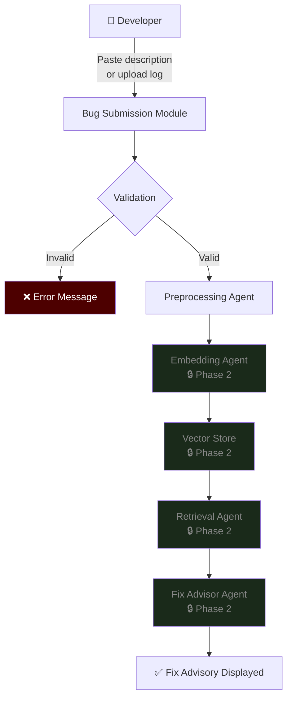
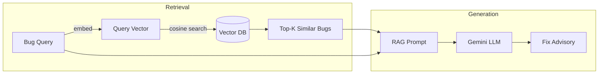
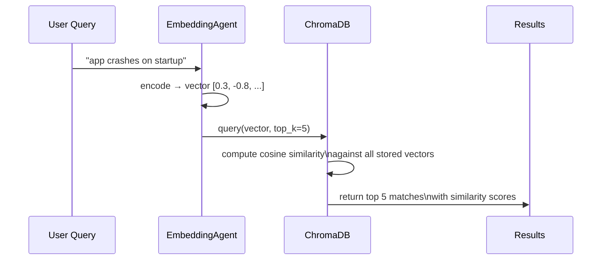

# Core Concepts — AI Smart Bug Analyzer

## 1. Project Workflow

The system takes a raw bug report (text or log file), processes it through a multi-agent
pipeline, retrieves similar historical bugs, and returns an AI-generated fix recommendation.



---

## 2. What is Retrieval-Augmented Generation (RAG)?

RAG is an AI architecture that combines two steps:

1. **Retrieval** — Find relevant documents from a knowledge base using semantic search.
2. **Generation** — Pass those documents as context to a large language model (LLM) to
   generate a grounded, accurate response.

### Why RAG instead of plain LLM?

| Problem with plain LLM | How RAG solves it |
|---|---|
| Hallucinations (confident but wrong answers) | Grounds answers in real, verified documents |
| No knowledge of your private codebase | Your own bug history is the knowledge base |
| Stale training data | Knowledge base is updated in real time |
| Generic advice | Advice is tailored to your exact tech stack |

### RAG in this project



---

## 3. What are Text Embeddings?

A **text embedding** is a list of floating-point numbers that encodes the *meaning* of a
piece of text in a high-dimensional space (e.g. 384 dimensions).

Sentences with similar meaning produce vectors that are *close together*; unrelated
sentences produce vectors that are *far apart*.

### Example

| Text | Embedding (simplified to 3D) |
|---|---|
| "NullPointerException in login service" | [0.81, -0.23, 0.55] |
| "Null reference error in authentication" | [0.79, -0.21, 0.58] ← very close |
| "Button colour is wrong on mobile" | [-0.40, 0.92, -0.11] ← far away |

### Why this matters for bug analysis

Keyword search for "NullPointerException" misses a C# `NullReferenceException` report
describing the same root cause. Embedding-based search finds it because both sentences
occupy the same region of vector space.

---

## 4. What is Vector Similarity Search?

Given a **query vector** (the embedding of a new bug report), vector similarity search
finds the *K nearest neighbours* in the stored vector database.

**Cosine similarity** is the most common distance metric:

```
similarity(A, B) = (A · B) / (|A| × |B|)
```

A score of **1.0** means identical meaning; **0.0** means completely unrelated.

### Search flow



---

## 5. Overall Project Pipeline

```mermaid
flowchart TD
    subgraph Phase1 ["✅ Phase 1 — Implemented"]
        A[User Input] --> B[SubmissionAgent]
        B --> C[PreprocessingAgent]
        C --> D[Temporary CSV Storage]
    end
    subgraph Phase2 ["🔒 Phase 2 — Planned"]
        D --> E[EmbeddingAgent]
        E --> F[ChromaDB Vector Store]
        F --> G[RetrievalAgent]
        G --> H[FixAdvisorAgent / Gemini]
        H --> I[Fix Advisory UI]
    end

    style Phase1 fill:#0a2a0a,stroke:#2a6a2a
    style Phase2 fill:#1a1a2a,stroke:#3a3a6a
```



---

## 6. Why these concepts are used for bug analysis

| Concept | Role in bug analysis |
|---|---|
| **Text embeddings** | Represent bug descriptions as semantic vectors so similar bugs cluster together regardless of exact wording |
| **Vector similarity search** | Efficiently find the most relevant historical bugs from a large knowledge base |
| **RAG** | Ground the LLM's fix advice in real, verified historical bugs — reducing hallucination |
| **LLM (Gemini)** | Synthesise retrieved context into a structured, actionable fix recommendation |
| **ChromaDB** | Persist and index vectors locally without an external database server |
