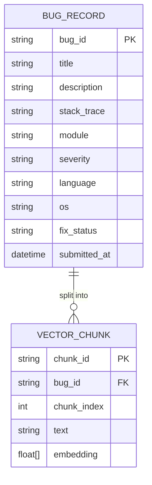

# Knowledge Base Schema

## 1. CSV Dataset Schema

File: `data/bug_dataset.csv`

| Column | Type | Required | Description |
|---|---|---|---|
| `BugID` | string | ✅ | Auto-generated unique identifier (e.g. `BUG-0001`) |
| `Title` | string | ✅ | Short one-line summary (first 80 chars of description) |
| `Description` | string | ✅ | Full free-text bug description entered by the user |
| `Module` | string | | Affected system module or service |
| `Priority` | enum | | `Critical` \| `High` \| `Medium` \| `Low` |
| `Severity` | enum | | `Critical` \| `High` \| `Medium` \| `Low` |
| `ProgrammingLanguage` | string | | e.g. `Python`, `Java`, `JavaScript` |
| `OperatingSystem` | string | | e.g. `Linux`, `Windows`, `macOS` |
| `StackTrace` | string | | Raw stack trace or log content |
| `ExpectedBehavior` | string | | What the user expected to happen |
| `ActualBehavior` | string | | What actually happened |
| `FixStatus` | enum | ✅ | `Open` \| `In Progress` \| `Fixed` \| `Closed` |
| `SubmittedAt` | datetime | ✅ | ISO timestamp in UTC |
| `LogFileName` | string | | Original filename of the uploaded log, if any |

---

## 2. Metadata Structure

Each bug record carries two layers of metadata:

### Primary metadata (stored in CSV)
Used for filtering, display, and future vector database metadata fields.

```json
{
  "BugID":               "BUG-A3F2C1B0",
  "Title":               "NullPointerException in UserService.getUser()",
  "Module":              "UserService",
  "Priority":            "High",
  "Severity":            "Critical",
  "ProgrammingLanguage": "Java",
  "OperatingSystem":     "Linux",
  "FixStatus":           "Open",
  "SubmittedAt":         "2024-01-10 09:15:00 UTC",
  "LogFileName":         "app.log"
}
```

### Document metadata (Phase 2 — stored in ChromaDB)
Attached to each vector to allow post-retrieval filtering.

```json
{
  "bug_id":    "BUG-A3F2C1B0",
  "severity":  "Critical",
  "language":  "Java",
  "os":        "Linux",
  "status":    "Open",
  "chunk_idx": 0
}
```

---

## 3. Future Vector Database Design (Phase 2)

### Technology: ChromaDB (local persistent store)



### ChromaDB collection configuration

```python
collection = client.get_or_create_collection(
    name="bug_reports",
    metadata={"hnsw:space": "cosine"},   # cosine similarity
)
```

### Chunking strategy

Long bug descriptions will be split with a sliding window:

| Parameter | Value |
|---|---|
| Chunk size | 200 words |
| Overlap    | 30 words |
| Embedding model | `all-MiniLM-L6-v2` (384 dimensions) |

---

## 4. Bug Document Format (Phase 2)

Each chunk stored in ChromaDB will have this structure:

```python
{
    "id":        "BUG-A3F2C1B0_chunk0",
    "embedding": [0.034, -0.217, 0.891, ...],   # 384 floats
    "document":  "nullpointerexception thrown when userid ...",
    "metadata": {
        "bug_id":    "BUG-A3F2C1B0",
        "severity":  "Critical",
        "language":  "Java",
        "os":        "Linux",
        "status":    "Open",
        "chunk_idx": 0,
    }
}
```

---

## 5. JSON Schema for Bug Storage

```json
{
  "$schema": "http://json-schema.org/draft-07/schema#",
  "title":   "BugReport",
  "type":    "object",
  "required": ["BugID", "Title", "Description", "FixStatus", "SubmittedAt"],
  "properties": {
    "BugID":               { "type": "string", "pattern": "^BUG-[A-Z0-9]+$" },
    "Title":               { "type": "string", "maxLength": 80 },
    "Description":         { "type": "string", "minLength": 1 },
    "Module":              { "type": "string" },
    "Priority":            { "type": "string", "enum": ["Critical","High","Medium","Low",""] },
    "Severity":            { "type": "string", "enum": ["Critical","High","Medium","Low",""] },
    "ProgrammingLanguage": { "type": "string" },
    "OperatingSystem":     { "type": "string" },
    "StackTrace":          { "type": "string" },
    "ExpectedBehavior":    { "type": "string" },
    "ActualBehavior":      { "type": "string" },
    "FixStatus":           { "type": "string", "enum": ["Open","In Progress","Fixed","Closed"] },
    "SubmittedAt":         { "type": "string", "format": "date-time" },
    "LogFileName":         { "type": "string" }
  }
}
```
