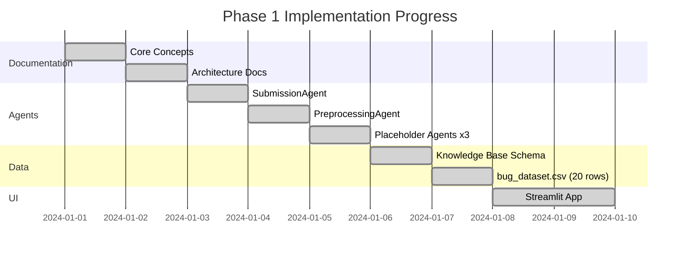

# Project Workflow

## Phase 1 — Completed (Tasks 1–5)

## Step-by-step workflow (Phase 1)

### Step 1 — User opens the app
`streamlit run app.py` launches the browser UI.
The sidebar shows project info; the main area shows the input form.

### Step 2 — User submits a bug
- Pastes a description in the text area, **or**
- Uploads a `.txt` / `.log` file, **or**
- Both.

### Step 3 — Validation
`Validator` checks:
- Description length ≤ 10 000 characters
- File extension is `.txt` or `.log`
- File size ≤ 512 KB
- At least one input is non-empty

Errors are shown inline; the pipeline stops.

### Step 4 — Submission
`SubmissionAgent` merges inputs, generates a `BugID`, sets a UTC timestamp,
saves the upload to `data/uploaded_logs/`, and appends a row to `bug_dataset.csv`.

### Step 5 — Preprocessing
`PreprocessingAgent` cleans description and log text:
lowercase → strip HTML → remove URLs → remove punctuation → collapse whitespace.

### Step 6 — Display
The UI shows:
- Bug ID and submission timestamp
- Source (text / file / merged)
- Cleaned preview
- Placeholder advisory (Phase 2 coming soon)

---

## Phase 2 — Planned

| Step | Agent | Technology |
|---|---|---|
| Text embedding | EmbeddingAgent | SentenceTransformers |
| Vector storage | — | ChromaDB |
| Similarity retrieval | RetrievalAgent | ChromaDB cosine search |
| Fix generation | FixAdvisorAgent | Google Gemini API |
